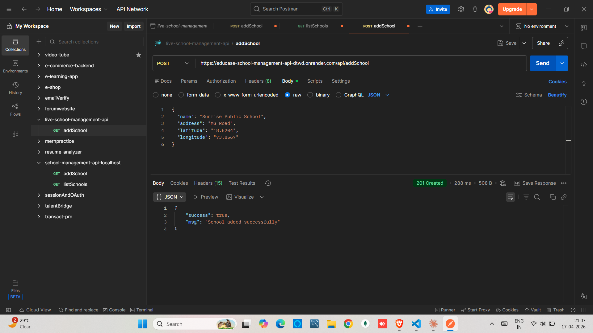

# 📚 School Management API

A RESTful API built using Node.js, Express.js, and MySQL that allows users to add schools and retrieve them sorted by proximity using geographic coordinates.

---

# 🚀 Features

- Add new school with proper validation
- Retrieve all schools sorted by nearest location
- Distance calculation using Haversine formula
- Schema validation using Zod
- Clean MVC architecture (Controller → Service → Utils)
- MySQL database integration using mysql2

---

# 🧰 Tech Stack

Node.js, Express.js, MySQL, mysql2, Zod, dotenv

---

# ⚙️ Setup Instructions

Install dependencies:
npm install

Create a .env file in root:

PORT=8080  
DB_HOST=your_host  
DB_USER=your_user  
DB_PASSWORD=your_password  
DB_NAME=your_database  
DB_PORT=3306  

Start server:
npm run dev

Server will run at:
http://localhost:8080

---

# 🗄️ Database Setup

Run the following SQL query in MySQL:

CREATE TABLE IF NOT EXISTS schools (
  id INT PRIMARY KEY AUTO_INCREMENT,
  name VARCHAR(100) NOT NULL,
  address VARCHAR(100) NOT NULL,
  latitude FLOAT NOT NULL,
  longitude FLOAT NOT NULL
);

---

# 📌 API ENDPOINTS

---

## ➤ 1. Add School

POST http://localhost:8080/api/addSchool 
Live API https://educase-school-management-api-dtwd.onrender.com/api/addSchool  

Request Body:
{
  "name": "Pune Public School",
  "address": "Pune",
  "latitude": 18.5204,
  "longitude": 73.8567
}

📸 Screenshot:

Response:
{
  "success": true,
  "message": "School added successfully"
}

---

## ➤ 2. List Schools (Sorted by Distance)

GET http://localhost:5000/api/listSchools?latitude=18.5204&longitude=73.8567  
Live API (if deployed): https://your-live-api-link.com/api/listSchools  

📸 Screenshot:

Response:
{
  "success": true,
  "schools": [
    {
      "id": 1,
      "name": "Pune Public School",
      "address": "Pune",
      "latitude": 18.5204,
      "longitude": 73.8567,
      "distance_in_km": 0
    }
  ]
}

---

# 📏 Distance Calculation

This project uses the Haversine formula to calculate distance between two geographical coordinates on Earth.

---

# 🧪 Testing Tools

Postman, Thunder Client, Browser (GET requests)

---

# 📸 Screenshots Required

Create a folder named `screenshots` in the root directory and add:

- add-school.png
- list-schools.png
- server-running.png
- database-table.png

Reference them like:

---

# ⭐ Notes

- Input validation handled using Zod
- Clean MVC architecture followed
- Accurate geolocation-based sorting using Haversine formula
- MySQL used for persistent storage

---

# 👨‍💻 Author

Your Name

---

# 📞 Contact

Email: your-email  
Phone: your-number
