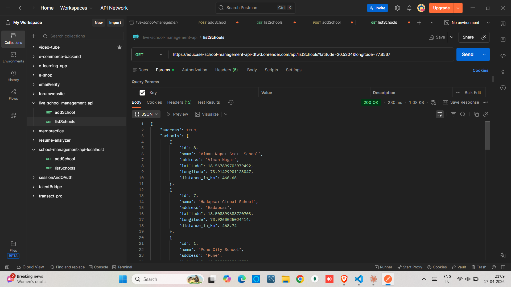

# 📚 School Management API

A RESTful API built using Node.js, Express.js, and MySQL that allows users to add schools and retrieve them sorted by proximity using geographic coordinates.

---

# 🚀 Features

- Add new school with proper validation
- Retrieve all schools sorted by nearest location
- Distance calculation using Haversine formula
- Schema validation using Zod
- Clean MVC architecture (Controller → Service → Utils)
- MySQL database integration using mysql2

---

# 🧰 Tech Stack

Node.js, Express.js, MySQL, mysql2, Zod, dotenv

---

# ⚙️ Setup Instructions

Install dependencies:
npm install

Create a .env file in root:

PORT=8080  
DB_HOST=your_host  
DB_USER=your_user  
DB_PASSWORD=your_password  
DB_NAME=your_database  
DB_PORT=3306  

Start server:
npm run dev

Server will run at:
http://localhost:8080

---

# 🗄️ Database Setup

Run the following SQL query in MySQL:

CREATE TABLE IF NOT EXISTS schools (
  id INT PRIMARY KEY AUTO_INCREMENT,
  name VARCHAR(100) NOT NULL,
  address VARCHAR(100) NOT NULL,
  latitude FLOAT NOT NULL,
  longitude FLOAT NOT NULL
);

---

# 📌 API ENDPOINTS

---

## ➤ 1. Add School

POST http://localhost:8080/api/addSchool 
Live API https://educase-school-management-api-dtwd.onrender.com/api/addSchool  

Request Body:
{
  "name": "Sunrise Public School",
  "address": "MG Road",
  "latitude": "18.5204",
  "longitude": "73.8567"
}

📸 Screenshot:

Response:
{
  "success": true,
  "message": "School added successfully"
}

---

## ➤ 2. List Schools (Sorted by Distance)

GET: http://localhost:8080/api/listSchools?latitude=20.5204&longitude=77.8567  
Live API: https://educase-school-management-api-dtwd.onrender.com/api/listSchools?latitude=20.5204&longitude=77.8567 

📸 Screenshot:

Response:
{
    "success": true,
    "schools": [
        {
            "id": 8,
            "name": "Viman Nagar Smart School",
            "address": "Viman Nagar",
            "latitude": 18.567899703979492,
            "longitude": 73.91429901123047,
            "distance_in_km": 466.66
        },
        {
            "id": 7,
            "name": "Hadapsar Global School",
            "address": "Hadapsar",
            "latitude": 18.508899688720703,
            "longitude": 73.9260025024414,
            "distance_in_km": 468.74
        },
        {
            "id": 1,
            "name": "Pune City School",
            "address": "Pune",
            "latitude": 18.52039909362793,
            "longitude": 73.85669708251953,
            "distance_in_km": 474.52
        },
        {
            "id": 10,
            "name": "Sunrise Public School",
            "address": "MG Road",
            "latitude": 18.52039909362793,
            "longitude": 73.85669708251953,
            "distance_in_km": 474.52
        },
        {
            "id": 6,
            "name": "Shivajinagar Central School",
            "address": "Shivajinagar",
            "latitude": 18.530799865722656,
            "longitude": 73.84750366210938,
            "distance_in_km": 474.82
        },
        {
            "id": 3,
            "name": "Wakad Modern School",
            "address": "Wakad",
            "latitude": 18.59749984741211,
            "longitude": 73.78980255126953,
            "distance_in_km": 476.73
        },
        {
            "id": 4,
            "name": "Baner Public School",
            "address": "Baner",
            "latitude": 18.55900001525879,
            "longitude": 73.78679656982422,
            "distance_in_km": 478.99
        },
        {
            "id": 11,
            "name": "Green Valley School",
            "address": "Baner Road",
            "latitude": 18.55900001525879,
            "longitude": 73.78679656982422,
            "distance_in_km": 478.99
        },
        {
            "id": 5,
            "name": "Kothrud Knowledge School",
            "address": "Kothrud",
            "latitude": 18.507400512695312,
            "longitude": 73.80770111083984,
            "distance_in_km": 479.75
        },
        {
            "id": 2,
            "name": "Hinjewadi Tech School",
            "address": "Hinjewadi",
            "latitude": 18.59119987487793,
            "longitude": 73.73889923095703,
            "distance_in_km": 481.82
        },
        {
            "id": 9,
            "name": "Andheri Excellence School",
            "address": "Andheri",
            "latitude": 19.11359977722168,
            "longitude": 72.86969757080078,
            "distance_in_km": 544.6
        },
        {
            "id": 12,
            "name": "St. Xavier High School",
            "address": "Dadar West",
            "latitude": 19.01759910583496,
            "longitude": 72.856201171875,
            "distance_in_km": 549.26
        },
        {
            "id": 13,
            "name": "National Public School",
            "address": "Indiranagar",
            "latitude": 12.971599578857422,
            "longitude": 77.59459686279297,
            "distance_in_km": 839.85
        }
    ],
    "user_location": {
        "latitude": 20.5204,
        "longitude": 77.8567
    }
}

---

# 📏 Distance Calculation

This project uses the Haversine formula to calculate distance between two geographical coordinates on Earth.

---

# 🧪 Testing Tools

Postman, Thunder Client, Browser (GET requests)

---

# ⭐ Notes

- Input validation handled using Zod
- Clean MVC architecture followed
- Accurate geolocation-based sorting using Haversine formula
- MySQL used for persistent storage

